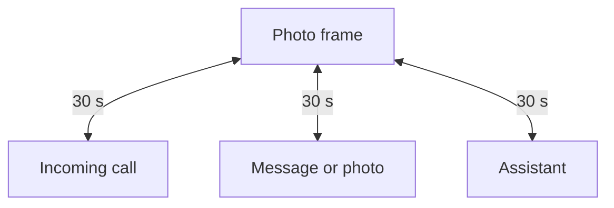
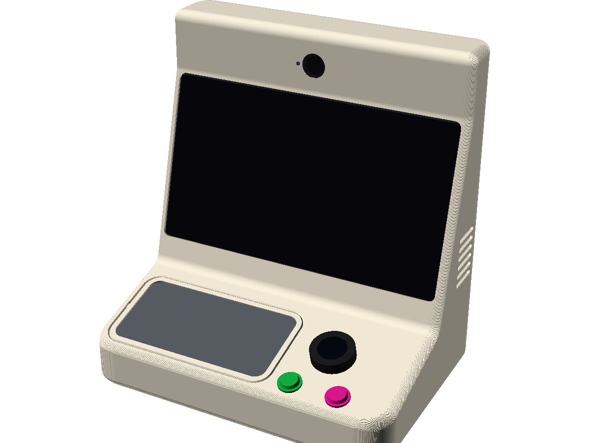

## Context

We all know elderly people living alone for whom the smartphone, the computer or the tablet are obstacles. The market offers them senior tablets with bigger menus, or closed connected frames whose lifespan is that of the company selling them.

The very reason I do software is to solve this kind of problem. So the idea is not new to me, but this year several building blocks became available to make it real:

1. **Language models** (LLMs) and **agentic AI**:
   1. With or without an Internet connection, and with the right tools, they can answer just about any question: fetch the news, a recipe, the weather, and so on.
   2. For development: building with a harness like Claude Code let me move much faster, which matters on a project this broad.

2. **Matrix**, discovered while setting up my homelab. Messages, photos and call signalling on a single protocol, end-to-end encrypted, and self-hostable.

3. **A2UI**, which composes the screen from a catalogue of components without the agent knowing anything about style.

## Building

To start, I wanted to build the whole software chain before touching any hardware. The point was to be sure the idea I had in mind was feasible, and that the pieces I had picked held up.

I started with the daemon, with one constraint: I wanted a single executable, while the AI ecosystem is overwhelmingly Python. TypeScript is that world's second language, hence Bun, which compiles to a binary. An unplanned benefit: the daemon and the mobile app share their code.

Then the make-or-break pieces, in order: Matrix, then Mistral and A2UI, then the wake word. All three held.

For testing, Element X, the official Matrix client, was a good companion. It let me check that messages and calls went through. But Kazimo needs an administrator, and I could not see myself administering the frame from Element X. So I built a mobile app for the family, which is a Matrix client with a bit of business logic.

## How it works

One principle: the object has states, not apps. At rest it is a photo frame, and everything returns to it after thirty seconds. There is no back button.

An incoming call is answered automatically or by pressing the green button. A message or a photo shows up as a card. The assistant answers out loud and keeps the screen for what is hard to say: a number, an image, a list.

Everything runs on a hidden mini PC. A TypeScript daemon on Bun, with Effect at its core for typed errors, retries and a degraded mode, talks to a self-hosted Matrix homeserver. Calls are MatrixRTC: Element Call in a Chromium kiosk on the object, the mobile app on the family side.

The wake word is an openWakeWord model run locally in ONNX. Until it fires, no sound leaves the machine. After that, transcription, agent and speech synthesis go through an OpenAI-compatible layer, where Mistral is a configuration choice. The agent composes the screen from a small catalogue of components, but style is out of its reach: the renderer enforces depth, column count and the ban on scrolling.

The whole pipeline relies on Mistral models with open weights:

- **Voxtral Mini** for transcription
- **Mistral Small 4** for the agent
- **Voxtral TTS** for the voice

Today they run on Mistral's API, but the same weights are downloadable. The full stack fits on a machine with 128 GB of unified memory, a smaller model brings it down to 32 GB ([the tiers](/writing/kazimo-mistral-local)).

## What pushed back

- **Encryption and ringing do not go together.** Call events are encrypted, so push rules cannot read them to route the notification. A design problem, not a bug, and the one that cost me the most.
- **The wake word only heard English.** The training set was missing multi-accent TTS clips.

## Today

In development, and fully software for now: the daemon, the kiosk and the family app. What comes next is hardware:

- A mini PC and a 15.6" screen
- A USB speakerphone
- An M5Stack Dial with a click wheel and two arcade buttons, the only physical controls
- A mmWave radar for presence
- A printed PETG monocoque, currently being modelled

The immutable OS image with automatic rollback is still to do.

The radar is meant to make the object proactive: walking into the room triggers the reading of messages and missed calls, with nothing to ask for. That is what is missing most today. The person I am building it for has seen it run and does not quite understand what it is yet. An object that never comes to her will not teach her what it can do.

