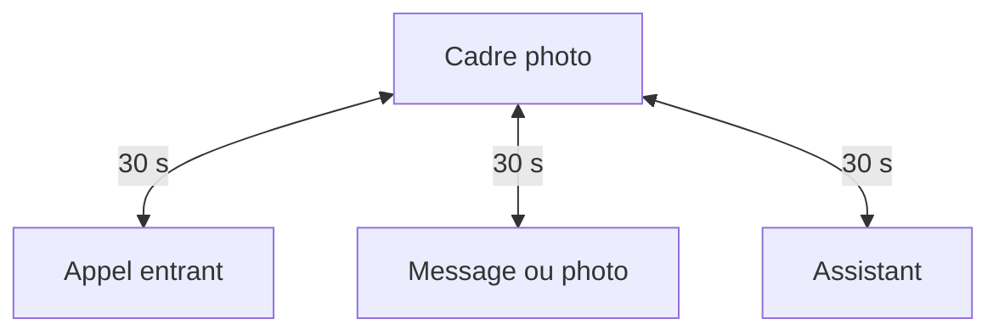

## Le contexte

On connaît tous des personnes âgées isolées, pour qui le smartphone, l'ordinateur ou la tablette sont des obstacles. Le marché leur propose des tablettes pour seniors avec des menus plus gros, ou des cadres connectés fermés dont la durée de vie est celle de l'entreprise qui les vend.

La raison même pour laquelle je fais de l'informatique est de solutionner ce genre de problème. C'est pourquoi pour moi, cette idée n'est pas nouvelle, mais cette année, plusieurs briques sont devenues disponibles pour la concrétiser :

1. **Les modèles de langage** (LLM) et l'**IA agentique** :
   1. Avec ou sans connexion à Internet et avec les bons tools, ils permettent de répondre à n'importe quelle question : aller chercher des news, une recette de cuisine, la météo, etc.
   2. Pour le développement : développer avec un harness comme Claude Code m'a permis de développer le projet bien plus rapidement, ce qui est important pour un projet aussi vaste que celui-ci.

2. **Matrix**, découvert en montant mon homelab. Messages, photos et signalisation d'appel sur un seul protocole, chiffré de bout en bout, et auto-hébergeable.

3. **A2UI**, qui permet de composer l'écran à partir d'un catalogue de composants, sans que l'agent ne connaisse le style.

## Construire

Pour commencer, je voulais développer toute la chaîne logicielle avant de toucher au matériel. L'idée c'était d'être sûr que l'idée que j'avais en tête était réalisable, et que les briques que j'avais choisies tenaient la route.

J'ai commencé par le démon, avec une contrainte : je voulais un exécutable unique, alors que l'écosystème IA est massivement Python. TypeScript est le second langage de ce monde, d'où Bun, qui compile en binaire. Avantage non prévu, le démon et l'app mobile partagent leur code.

Ensuite les points de rupture, dans l'ordre : Matrix, puis Mistral et A2UI, puis le wake word. Les trois ont tenu.

Pour mes tests, Element X, le client Matrix officiel, a été un bon compagnon. Il m'a permis de vérifier que les messages et les appels passaient bien. Seulement, Kazimo nécessitant un administrateur, je ne me voyais pas administrer le cadre depuis Element X. J'ai donc développé une app mobile pour la famille, qui est un client Matrix avec un peu de logique métier.

## Le fonctionnement

Un principe : l'objet a des états, pas des applications. Au repos, c'est un cadre photo, et tout y revient après trente secondes. Il n'y a pas de bouton retour.

Un appel entrant est décroché automatiquement ou par appui sur le bouton vert. Un message ou une photo apparaît sous forme de carte. L'assistant répond à voix haute et réserve l'écran à ce qui se dit mal : un chiffre, une image, une liste.

Tout tourne sur un mini PC caché. Un démon TypeScript sous Bun, avec Effect au cœur pour les erreurs typées, les retries et le mode dégradé, parle à un homeserver Matrix auto-hébergé. Les appels sont du MatrixRTC : Element Call dans un Chromium en kiosque côté objet, l'app mobile côté famille.

Le wake word est un modèle openWakeWord exécuté en local en ONNX. Tant qu'il ne s'est pas déclenché, aucun son ne quitte la machine. Après, transcription, agent et synthèse vocale passent par une couche compatible OpenAI, où Mistral est un choix de configuration. L'agent compose l'écran à partir d'un petit catalogue de composants, mais le style lui échappe : c'est le renderer qui impose la profondeur, le nombre de colonnes et l'interdiction de défiler.

Toute la chaîne repose sur des modèles Mistral à poids ouverts :

- **Voxtral Mini** pour la transcription
- **Mistral Small 4** pour l'agent
- **Voxtral TTS** pour la voix

Ils tournent aujourd'hui sur l'API de Mistral, mais les mêmes poids se téléchargent. La pile complète tient sur une machine à 128 Go de mémoire unifiée, un modèle plus petit la ramène à 32 Go ([les paliers](/fr/writing/kazimo-mistral-local)).

## Ce qui a résisté

- **Le chiffrement et la sonnerie ne vont pas ensemble.** Les événements d'appel étant chiffrés, les règles de push ne peuvent pas les lire pour router la notification. Un problème de conception, pas un bug, et celui qui m'a coûté le plus.
- **Le wake word n'entendait que l'anglais.** Il manquait des clips TTS multi-accents à l'entraînement.

## Aujourd'hui

En cours de développement, et entièrement logiciel pour l'instant : le démon, le kiosque et l'app famille. La suite est matérielle :

- Un mini PC et un écran 15,6"
- Un speakerphone USB
- Un M5Stack Dial avec molette et deux boutons arcade, pour les seules commandes physiques
- Un radar mmWave pour la présence
- Une monocoque imprimée en PETG, en cours de modélisation

L'image système immuable avec rollback automatique reste à faire.

Le radar doit rendre l'objet proactif : entrer dans la pièce déclenche la lecture des messages et des appels manqués, sans rien demander. C'est ce qui manque le plus aujourd'hui. La personne pour qui je le construis l'a vu tourner et ne comprend pas encore bien ce que c'est. Un objet qui ne vient jamais vers elle ne lui apprendra pas ce qu'il sait faire.

