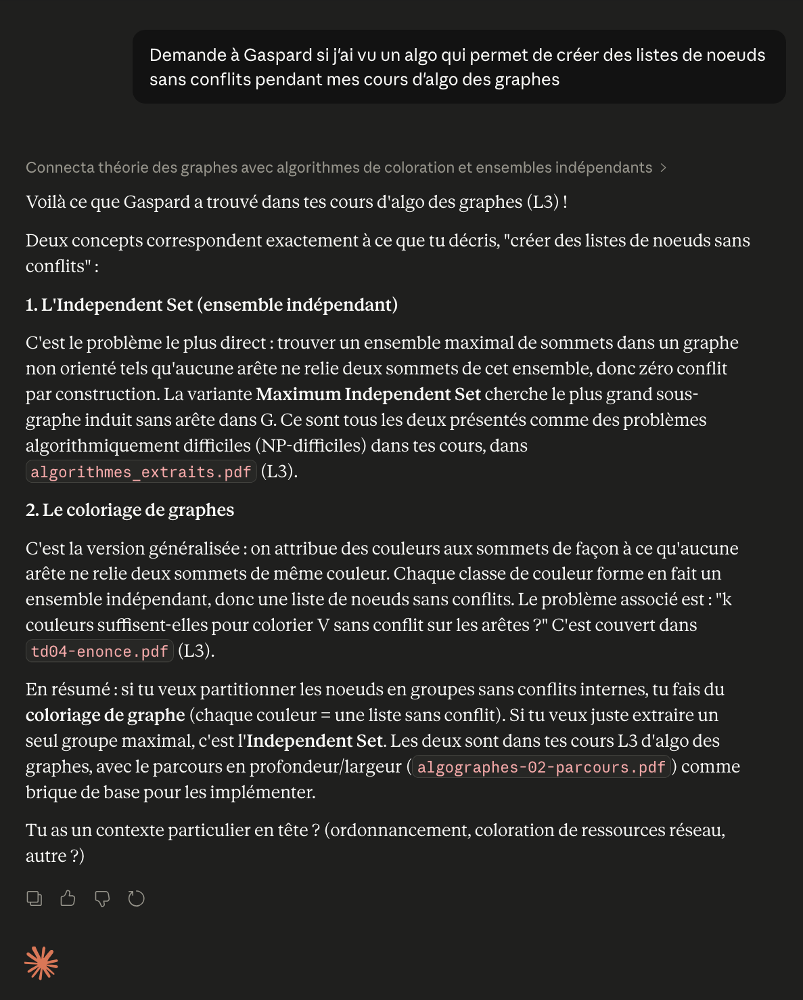

L'autre jour, sur le Neo4j Browser, je voulais faire une requête Cypher simple : trouver des nœuds sans relation entre eux. Je me dis : "Attends, c'est pas un truc qu'on a vu en L3 en algo des graphes ?". Sûr et certain, mais impossible de remettre la main dessus dans cinq ans d'archives.

L'idée de me construire un RAG sur mes cours me trottait dans la tête depuis la fin de mes études, sans urgence réelle. Là j'avais le déclic, et l'occasion de creuser les LLMs locaux par la même occasion.

Voilà Gaspard : un serveur MCP branché à un index LightRAG (graphe + vecteurs) sur mes 5 ans de cours, accessible directement depuis claude.ai.

## Le corpus

Le corpus, c'était presque le plus compliqué à construire.

- quelques uns de mes fichiers
- un peu de scraping des sites web des profs (heureusement que j'avais gardé les liens)
- des PDF de cours qu'il me restait

Au total : 959 fichiers, après un filtrage assez agressif. J'ai exclu le code source brut (`.py`, `.java`, `.c`...), les notes tierces, les docs admin, et les matières non-info (algèbre, analyse...). Sinon le knowledge graph s'engorge avec des entités du genre `printf` ou `getInstance` qui polluent les recherches.

## Pourquoi LightRAG plutôt qu'un RAG vectoriel pur ?

Le choix du knowledge graph plutôt qu'un RAG vectoriel pur, c'est ce qui change tout sur ce corpus. Demander "qu'est-ce que j'ai vu en concurrence en master ?" renvoie un cluster d'entités connectées (`ReentrantLock`, `synchronized`, `volatile`...) plutôt qu'une liste de chunks isolés. Sur 5 ans d'études, les concepts sont inter-reliés (du java de la L3 au M2, de la complexité algorithmique tout au long du cursus), et le saut qualitatif d'un KG sur ce genre de corpus est réel.

Concrètement, LightRAG a besoin de deux modèles pour fonctionner :

- un modèle d'**embeddings**, pour vectoriser les chunks à l'ingestion et les requêtes au moment du query
- un **LLM d'extraction**, pour identifier les entités et les relations qui peuplent le knowledge graph

C'est cette double contrainte qui a piloté tous les choix de modèles ensuite.

## Tout en local

L'ambition était simple : zéro API externe, tout en local pour l'ingestion. Sauf que sur mes 24 Go de RAM en Apple Silicon, faire tenir les deux modèles en même temps, c'est serré.

Pour le LLM d'extraction, j'ai d'abord voulu tester les modèles les plus gros que je pouvais faire tourner, pour maximiser la qualité (lfm2, Qwen3.6 27B), mais avec le modèle d'embedding à côté et le contexte, ça ne passait pas confortablement.

Je me suis rabattu sur un des derniers modèles de Google, Gemma 4 E4B, qui est un modèle de reasoning par défaut. Mauvaise nouvelle pour de l'extraction structurée : LightRAG attend du JSON propre, et la chaîne de raisonnement parasite le format de sortie tout en doublant la latence pour zéro bénéfice sur ce genre de tâche. Heureusement, LM Studio référençait une version -it d'Unsloth qui désactive le reasoning, et là ça tourne bien. En bonus, Gemma 4 est vision-capable, donc Docling (l'outil que j'utilise pour le parsing de docs) lui passe les schémas et figures des PDF (automates, arbres B, graphes d'algos), il les décrit, et c'est indexé comme du texte normal.

Côté embeddings, j'avais aussi commencé par tester Qwen3-Embedding-8B, mais combiné au LLM d'extraction, ça ne tenait plus en RAM. Je suis passé à Qwen3-Embedding-0.6B : la qualité de retrieval ne change pas significativement, ça divise par dix la RAM nécessaire, et ça permet de l'héberger sur CPU dans le cluster sans souffrir.

## Le MCP

LightRAG fait normalement deux appels LLM par requête : un pour extraire les keywords, un pour synthétiser la réponse. Sur un cluster sans GPU, ça veut dire payer une API.

Sauf que LightRAG expose un endpoint `/query/data` qui renvoie uniquement les fragments récupérés (entités, relations, chunks, citations) sans synthèse. Et il accepte des `hl_keywords` / `ll_keywords` pré-extraits, ce qui court-circuite le premier appel LLM aussi. Du coup, l'idée : déporter les deux appels LLM côté claude.ai.

1. Claude lit ma question, en déduit les keywords haut/bas niveau, appelle mon MCP avec.
2. Le serveur fait la retrieval pure sur Qdrant + Neo4j, renvoie les fragments.
3. Claude rédige la réponse en citant mes fichiers.

Côté serveur : zéro token facturé. Mon abonnement claude.ai fait tout le boulot LLM. Le MCP server lui-même tient en une cinquantaine de lignes de Python (FastMCP).

## Déploiement sur Talos

Sur Talos (mon cluster k8s perso), j'ai d'abord déployé les trois bases dont LightRAG a besoin pour stocker son état :

- **Qdrant** pour les vecteurs
- **Neo4j** (DozerDB) pour le graphe
- **Valkey** pour le cache KV

L'idée : pendant l'ingestion, le Mac écrit directement dans ces bases via le LAN. Une fois l'ingestion terminée, le LightRAG query-only que je lance sur le cluster réutilise tel quel les données déjà persistées. Le Mac devient un worker stateless qu'on éteint après.

Côté ingestion donc : LM Studio + Gemma 4 E4B + Docling sur le Mac, vers les bases Talos. Lent : 5 passes, une par année d'étude, presque 3 jours en tout.

Côté serving sur le cluster : aucun LLM hébergé, que de la retrieval. Les bases déjà peuplées + un serveur llama.cpp pour les embeddings (Qwen3-Embedding-0.6B Q8_0, accéléré sur l'iGPU Intel des nodes via Vulkan). J'étais initialement parti sur TEI, mais OOM sur 16 Go : llama.cpp est plus léger et m'a donné l'iGPU en bonus.

Le MCP server est exposé à claude.ai via un Cloudflare Tunnel.

## Et maintenant, est-ce que ça marche ?

Pour boucler la boucle, j'ai posé à Claude la question qui a tout déclenché.

Pas juste une réponse, mais deux concepts liés (Independent Set et coloration de graphes) avec citations vers les vrais PDF de L3.
